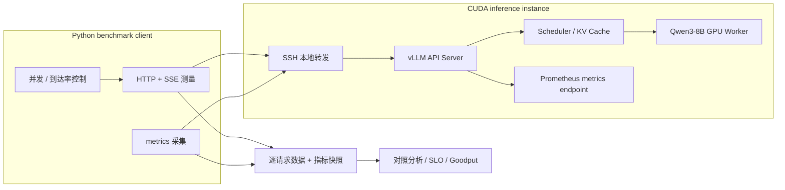
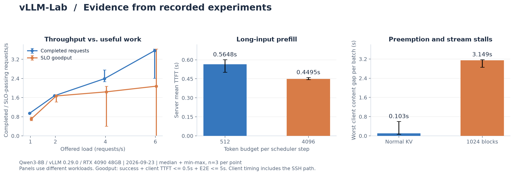

# vLLM Inference Systems Lab

**LLM Serving · Runtime Observability · Scheduler Characterization · SLO Benchmarking**

围绕 **vLLM V1 / Qwen3** 执行链路构建推理性能实验体系，覆盖 **Metal / CUDA 后端验证、Prefill–Decode 调度约束分析、KV Block 压力实验、引擎指标差分与 SLO 约束下的负载评估**。

以 request-level SSE event timelines、engine metric deltas 和服务启动配置为联合证据，刻画 `max-num-seqs`、`max-num-batched-tokens` 与 KV 容量边界对 TTFT、流式停顿、聚合输出吞吐及 Goodput 的影响。实验客户端、观测采集器和结果分析工具均随仓库归档。

[Architecture](docs/architecture.md) · [性能证据](#实验结果) · [运行与复现](#运行与复现) · [实验报告](phase3/README.md) · [机制笔记](phase3/learning_notes/README.md)

`Python` · `vLLM` · `CUDA / Metal` · `HTTP / SSE` · `Prometheus metrics` · `Benchmark / Goodput`

## Technical Scope

| 工程域 | 实现与分析对象 | 实现入口 |
| --- | --- | --- |
| **Heterogeneous Backend Validation** | Apple Silicon / vLLM-Metal 与 NVIDIA CUDA 两套执行环境；模型注册、Chat Completions 协议、SSE completion lifecycle 验证 | [Metal runtime](run_server.sh) · [CUDA baseline](phase3/README.md) |
| **Workload Orchestration** | Barrier-synchronized burst、closed-loop concurrency、deterministic open-loop arrivals；固定输出工作量与 client release lag 记录 | [scheduler_capacity.py](phase3/scheduler_capacity.py) · [load_curve_benchmark.py](phase3/load_curve_benchmark.py) |
| **Runtime Instrumentation** | Gauge 时间序列、Counter 增量、Histogram delta；Running / Waiting / KV occupancy / Preemption 与 request-level latency 对齐分析 | [token_budget_benchmark.py](phase3/token_budget_benchmark.py) · [counter walkthrough](phase3/metrics_counter_walkthrough.py) |
| **Scheduler Characterization** | Sequence admission、iteration-level token budget、Chunked Prefill 与 Decode overlap；区分序列名额、每轮 token budget、KV 空间三类约束 | [Token Budget matrix](phase3/results/token_budget_comparison_20260923.md) |
| **KV & Prefix Cache Analysis** | 基于模型结构的 KV footprint 估算、block-budget 对照、Preemption / Recompute 现象分析；shared-prefix / changed-prefix counter 验证 | [KV pressure](phase3/results/kv_pressure_comparison_20260923.md) · [prefix reuse](phase3/prefix_partial_reuse.py) |
| **SLO-constrained Load Evaluation** | Offered load / achieved throughput / Goodput 分离；TTFT 与 E2E 联合约束、尾延迟与运行间波动分析 | [load_curve_benchmark.py](phase3/load_curve_benchmark.py) |
| **Request Lifecycle & Recovery** | Stream disconnect、socket timeout、queue drain 与 post-cancellation recovery probes；识别 abort counter 的观测盲区 | [cancellation probe](phase3/overload_recovery_probe.py) · [timeout probe](phase3/client_timeout_probe.py) |
| **Reproducible Analysis Artifacts** | Warmup/formal 隔离、逐请求结果、metrics 前后快照、选定服务日志；带 source provenance 的离线统计与图表重建 | [raw artifacts](phase3/results/) · [build_showcase.py](tools/build_showcase.py) |

## Runtime Architecture



客户端负载生成、指标采集和结果分析由本仓库提供；API Server、调度器、PagedAttention / KV 管理与 GPU 执行由 vLLM 提供。Mac 本地基线使用独立的 Metal 后端。组件边界、数据结构和设计取舍见 [架构说明](docs/architecture.md)。

## 实验结果



图表由已提交的 **2026-09-23 原始 JSON** 重新汇总生成。各点取 3 次正式运行的中位数，误差线为最小值–最大值；三个面板使用不同负载。数字可通过 [来源清单与机器汇总](docs/assets/evidence-summary.json) 追溯。

| Characterization Axis | 实验设计与结果 | 分析结论 |
| --- | --- | --- |
| **Admission-bound Queueing** | 6 并发下，`max-num-seqs=4` 时 Running=4、Waiting=2；改为 8 后 Waiting=0，整批耗时 13.672 → 8.185 s。每组仅 1 次 | 序列名额限制影响完成时间；单批结果用于机制观察。[报告](phase3/results/scheduler_capacity_comparison.md) |
| **Token-budget Sensitivity** | 512/4096 × short/long/mixed，共 18 个正式批次、108 个请求。长输入服务端平均 TTFT 的三次中位数 0.5648 → 0.4495 s；混合负载服务端平均 ITL 约增加 4.1% | Prefill 首 token 延迟与 Decode 间隔存在取舍，吞吐变化依赖负载形状。[报告](phase3/results/token_budget_comparison_20260923.md) |
| **KV Pressure & Preemption** | 正常池与 1024-block 受控池各 3 批、8 并发；受控组每批 Preemption +1，最大单请求停顿约 2.86–3.17 s，吞吐中位数下降 6.1% | 联合 KV、counter、队列与请求停顿定位抢占；此实验验证机制，不能据此推算正常显存池容量。[报告](phase3/results/kv_pressure_comparison_20260923.md) |
| **SLO-constrained Throughput** | 4 档并发 + 4 档到达率，每点 3 次、每次 12 请求，共 288/288 成功；同时计算 TTFT ≤ 0.5 s、E2E ≤ 5 s 的 Goodput | 完成率与 SLO 达标率是不同指标；6 req/s 下已出现 Waiting。[报告](phase3/results/benchmark_capacity_curve_20260923.md) |
| **Overload & Lifecycle Recovery** | 10 req/s 注入 40 请求，Waiting 峰值 21、KV 峰值 1.55%、无抢占；40/40 成功，但 SLO 达标率仅 20%；另完成断流和超时探针 | 识别普通排队过载，并验证请求清理及恢复；abort counter 存在观测缺口。[报告](phase3/results/overload_recovery_20260923.md) |

**环境与解释范围：** 上述 CUDA 实验使用 Qwen3-8B BF16、vLLM 0.29.0、单张 RTX 4090（实验实例报告 49140 MiB），客户端通过 Mac → SSH 链路访问。客户端延迟包含网络与缓冲；短批次、少量重复的实验结果用于解释机制和筛选候选配置，尚不足以给出生产稳定 QPS。

另有 [Mac Metal 基线](phase2/README.md) 与 [云端首次调用及基线](phase3/results/cloud_baseline.md)。两端的模型、输入与链路不同，不作硬件性能横向排名。

## Instrumentation & Measurement Model

### Request-level / Engine-level 分层观测

客户端以 `perf_counter()` 记录请求开始、首个非空 SSE 内容事件、内容事件间隔和请求结束；服务端指标由 `/metrics` 周期采样与批次前后快照构成。两者联合使用，但保留各自的时间与聚合语义。

| 观测层 | 关键量 | 统计语义 |
| --- | --- | --- |
| Client | TTFT、E2E、max content gap、release lag | 端到端时延含 SSH 与网络；SSE 事件不等于单 token |
| Scheduler | Running、Waiting、capacity Waiting | 离散采样峰值；用于约束分析，不能单独判定 Preemption |
| KV / Cache | KV occupancy、Preemption delta、prefix hit/query delta | Counter 需以同一服务实例、隔离流量下的前后差值解释 |
| Engine latency | Queue time / TTFT / ITL histograms | 批次均值来自 `Δsum / Δcount`；分位数保留为 bucket upper bound |
| Service objective | SLO attainment、Goodput | 成功响应还需同时满足 TTFT 与 E2E 阈值 |

对服务端累计 Histogram，批次均值采用：

```math
\bar{t}_{\mathrm{batch}} = \frac{S_{\mathrm{after}}-S_{\mathrm{before}}}{C_{\mathrm{after}}-C_{\mathrm{before}}}
```

对完成观测窗口 `T`，将吞吐与 SLO 有效吞吐分开：

```math
X = \frac{N_{\mathrm{success}}}{T}, \qquad
G = \frac{\sum_i \mathbf{1}[\mathrm{success}_i \land \mathrm{TTFT}_i \le \tau_f \land \mathrm{E2E}_i \le \tau_e]}{T}
```

归档负载曲线预先固定 `TTFT ≤ 0.5 s`、`E2E ≤ 5 s`；它们是实验 SLO。TTFT/E2E 从实际请求开始计时，计划释放滞后单独记录；因此 `release_lag` 仍需参与 open-loop 有效性复核。

### KV Footprint 与压力实验

对于本次 Qwen3-8B 的均匀全注意力结构，理论 KV 存储量按层数、KV heads、head dimension 与元素字节数估算：

```math
M_{\mathrm{KV/token}}=2 \times L \times H_{\mathrm{KV}} \times D_h \times B
=2 \times 36 \times 8 \times 128 \times 2
=144\,\mathrm{KiB}
```

16-token block 对应约 2.25 MiB 的理论 KV 数据。实验通过 `num-gpu-blocks-override=1024` 受控限制逻辑池，将 **KV 接近上限 → Preemption counter 增长 → Running/Waiting 迁移 → 单请求长停顿** 串联验证。该估算不等于总 GPU 显存占用，也不直接给出生产并发容量。

### Experimental Controls

固定输出长度、定义输入形状并限制跨批次前缀复用；配置变更以服务启动日志确认。Warmup 与 formal runs 分离，正式结果保留中位数、min/max 和异常批次。Histogram / Preemption 差值在缺失时保留 `null`；部分 gauge 的缺失语义尚未统一，详见 [结果契约与实现边界](docs/architecture.md#指标与结果契约)。

## 运行与复现

### 离线查看与重建报告

不需要模型、GPU 或正在运行的服务：

```bash
# 使用 Python 标准库，核对已归档实验并重建带来源的 JSON 汇总
python3 tools/build_showcase.py --json-only

# 只预览测试负载，不请求服务或写入实验结果
python3 phase3/token_budget_benchmark.py --budget 4096 --shape mixed --dry-run
```

重新绘制图表时，使用项目内独立环境，不改动推理环境：

```bash
python3 -m venv .venv-report
.venv-report/bin/python -m pip install -r tools/requirements-report.txt
MPLCONFIGDIR="$PWD/.cache/matplotlib" .venv-report/bin/python tools/build_showcase.py
```

### 连接已准备好的 CUDA 服务

先按 [云端服务说明](phase3/README.md) 准备 Qwen3-8B 服务和 SSH 转发。当前脚本不会创建云实例、部署模型或修改服务配置。

```bash
curl -fsS http://127.0.0.1:18000/health
curl -fsS http://127.0.0.1:18000/v1/models

# 固定并发与固定到达率；预热示例和正式示例分别执行
python3 phase3/load_curve_benchmark.py --mode closed --concurrency 4 --requests 12 --warmup
python3 phase3/load_curve_benchmark.py --mode closed --concurrency 4 --requests 12
python3 phase3/load_curve_benchmark.py --mode open --rate 2 --requests 12 --slo-ttft 0.5 --slo-e2e 5

# 调度对照、指标增量与共享前缀验证
python3 phase3/scheduler_capacity.py --requests 6 --tokens 384
python3 phase3/token_budget_benchmark.py --budget 4096 --shape mixed
python3 phase3/metrics_counter_walkthrough.py
python3 phase3/prefix_partial_reuse.py
```

客户端实验脚本仅依赖 Python 标准库，数据写入 `phase3/results/`。复现报告中的统计需按其负载、预热和重复次数运行；上面命令只是单批入口。`--budget` 是服务端配置标签，**不会替你修改 vLLM 参数**。超时和取消探针会主动中断请求，使用独占实验实例运行。

### 本地 Metal 基线

已有适配 vLLM-Metal 的项目内 `.venv` 和模型时：

```bash
source env.sh
./run_server.sh
# 在另一个已激活环境的终端执行
./test_api.sh
```

这不是新机器的一键安装入口；本地 Phase 2 保留原始数据，部分临时采集脚本未归档，详见 [Phase 2 说明](phase2/README.md)。

## Repository Layout

```text
vllm-lab/
├── env.sh / run_server.sh / test_api.sh  # 本地 Metal 环境与服务检查
├── phase2/                             # 本地参数实验与基线归档
├── phase3/
│   ├── *_benchmark.py                  # 流式测量、token budget、负载曲线
│   ├── *_probe.py                      # 取消、超时与恢复探针
│   ├── results/                        # 原始 JSON、实验报告、选定日志
│   └── learning_notes/                 # 调度、缓存、benchmark、运维笔记
├── docs/architecture.md                # 实现边界、数据流与工程取舍
├── docs/assets/                        # 从历史数据生成的图表与来源清单
└── tools/build_showcase.py             # 离线汇总与展示图生成
```

## Engineering Roadmap

当前实现覆盖单实例 runtime characterization、benchmark instrumentation 与故障恢复探测。后续扩展方向：

- **容量可信度：** 更长稳态负载、更多重复、同机房客户端、真实输入/输出长度分布。
- **观测完整性：** 统一缺失指标处理，补充取消路径证据、长期 Prometheus / Grafana 与告警。
- **服务治理：** 鉴权、TLS、入口限流、代理层背压及有界重试；目前尚未实现。
- **部署与扩展：** 服务端环境自动化、多实例路由与故障恢复；目前未覆盖。
- **量化对照：** 独立比较权重量化与 KV dtype；本仓库尚无 FP8 / AWQ / GPTQ 的实测结果。
