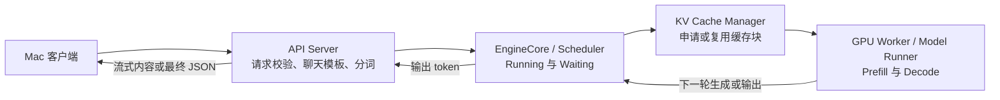

# 一条请求在 vLLM 中如何运行

记录日期：2026-09-22。本文依据此前保存的云端实验结果解释请求路径；写作时实例已关机，没有新增请求或性能测试。

## 服务路径（简化）

API Server 把聊天消息准备成模型输入；EngineCore 的 Scheduler 决定每轮处理哪些请求和多少 token，并管理 KV 缓存块；GPU Worker 执行模型前向计算；生成结果返回 API Server，再发送给客户端。下图是帮助理解的简化路径，不是完整进程或函数调用图。

## 用六请求结果解释调度

Mac 同时提交 6 个不同请求，每个请求固定输出 384 tokens。API Server 接收和处理请求后交给引擎。`max-num-seqs=4` 时，引擎最多同时处理 4 条序列，因此监控中观测到 `max_running=4`、`max_waiting=2`。前 4 条约 6.8 秒完成，后 2 条约 13.5 秒完成。改为 `max-num-seqs=8` 后，6 条都可以运行，观测到 `max_running=6`、`max_waiting=0`，全部约 8.1 秒完成。两组都成功，总输出都是 2304 tokens。

这并不表示把上限调大能让 GPU 的单步计算变快，而是减少了本次负载的排队。单次实验里，总耗时从 13.672 秒降到 8.185 秒，但先完成的那 4 条请求各自反而比上限为 4 时稍慢。详细原始数据和局限见 [对照记录](../results/scheduler_capacity_comparison.md)。

一个更小的调度示意（不是本次测试的精确时间线）：假设 A、B、C、D 正在运行，E、F 等待。如果 A 提前结束，E 就可以进入；不必等 B、C、D 全部结束再组成下一批。这是“连续批处理”的关键。假如一条请求是“15 加 27 等于多少”，API Server 先将聊天消息按模型的聊天模板转换并分词；轮到它运行时先处理输入，之后生成回答 token，最终由 API Server 返回“42”和 `usage`、`finish_reason` 等信息。

## 单条请求在 GPU 上经历什么

1. **Prefill**：处理输入 prompt 的 token，计算注意力并建立输入部分的 KV Cache，准备生成首个回答 token。
2. **Decode**：按自回归方式继续生成；在本次普通生成的简化模型中，每轮通常为每条正在运行的序列增加一个新 token，并复用已有 KV。多个请求可以在连续批处理中被动态合到执行批次，而不是必须等一个固定批次全部结束。
3. **结束**：达到停止条件或输出长度上限后，释放本请求占用的运行容量；缓存块是否保留供前缀复用，取决于缓存管理和淘汰情况。API 返回 `finish_reason`、`usage` 等字段。

本次实验把 `min_tokens=max_tokens=384`，所以 `finish_reason=length` 是预期的实验截断，不是请求失败。

## 三个容易混淆的限制

- `max-num-seqs`：一轮最多同时处理多少条序列；本次对照改变的就是它。
- `max-num-batched-tokens`：一次调度的 token 预算；与序列条数限制不是同一回事。
- KV Cache 容量：输入和输出越长、并发越高，通常需要越多缓存块。此次观测的最大使用率约 1.216% 与 1.907%，没有显示 KV 容量耗尽；2 条请求等待与序列条数上限一致。

`Running/Waiting` 是引擎状态，不等于网络连接数；`TTFT` 包含请求进入服务后的多项开销，不能直接当作纯 Prefill 时间。`prompt_tokens` 与 `completion_tokens` 分别是输入和输出 token 数，不是显存使用量。

## 这份数据还不能说明什么

- 本次只改变 `max-num-seqs`，没有对 `max-num-batched-tokens` 或 KV Cache 容量做压力测试，因此无法据此判断它们在更长输入、更高并发下何时成为瓶颈。
- `Running/Waiting` 证明了请求在调度器中的状态变化，但没有给出 Prefill、Decode 每一阶段的独立耗时。
- 观察到 KV Cache 使用率，不等于验证了 PagedAttention 的块分配或淘汰策略；这些需要另外设计实验。

## 对照资料

- [vLLM 架构总览](https://docs.vllm.ai/en/latest/design/arch_overview.html)：理解 API Server、Engine Core、GPU Worker 的职责。
- [vLLM v0.29.0 Scheduler 源码](https://github.com/vllm-project/vllm/blob/v0.29.0/vllm/v1/core/sched/scheduler.py) 与 [KV Cache Manager 源码](https://github.com/vllm-project/vllm/blob/v0.29.0/vllm/v1/core/kv_cache_manager.py)：与实验环境版本一致；先认模块职责，不要求逐行阅读。
- [vLLM v0.29.0 指标文档](https://docs.vllm.ai/en/v0.29.0/usage/metrics/)：核对 Running、Waiting、KV 使用率、TTFT 等指标的含义。
